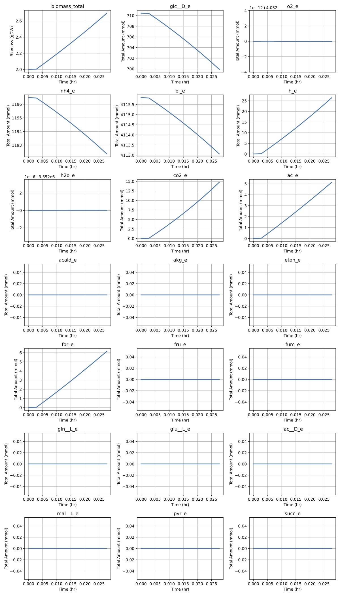

# Spatial Bioprocessing
Coupled simulation of fluid transport and cell dynamics in bioprocessing.

This repository contains an implementation of **Spatially Varying Bioprocess Simulation**. Specifically, it combines *fluid advection* according to a pre-specified velocity field with *biomass growth and metabolite consumption* due to a mechanistic model. We explicitly handle: 
- Spatial advection via semi-Lagrangian methods
- Biomass growth 
- Time-varying extracellular concentrations of metabolites
- Setpoint modeling via clamping 
- Optional biomass growth inhibition due to waste products
- Flexible modeling via COBRApy's metabolic modeling backend 
- Built-in logging to CSV and plotting utilities 

## Installation 

Fork/clone and install. 
```bash
git clone https://github.com/YOUR_USERNAME/spatialBioprocessing.git
cd spatialBioprocessing
```

## Python Requirements 

We recommend Python 3.10+ and pip for package management. 

```bash
pip install -r requirements.txt
```

## Core Logic 

The core logic of the simulation is in the `SpatialSimulator.py` file. In a nutshell, this class does the following. 

1. Initializes SpatialSimulator object with information from a config file (e.g. `configs/ecoli_config1.json`). The config file specifies Michaelis-Menten constants, the name of the COBRA model (e.g. `textbook`) to be used, mesh density (via `nx`, `ny`, and `nz` for a cubic mesh) and other simulation parameters. 
2. Stores a pre-specified velocity field as a tensor $v \in \mathbb{R}^{n_x \times n_y \times n_z \times 3}$, where each $v[i,j,k]$ is a velocity vector in $\mathbb{R}^3$ arising from steady-state solutions to the underlying fluid equations. 
3. Stores biomass and extracellular concentrations for exchange reactions. 
4. Advects all cellular and extracellular quantities according to the velocity field specified in (2). 
5. At each grid voxel, uses Michaelis-Menten formulas to update flux bounds for uptake reactions based on extracellular concentrations. For metabolite $m$ with concentration $C(m)$ and parameters $V_{max}(m), K_m(m)$, the flux lower bound $\ell_M$ becomes: 

$$\ell_M = -V_{max}(m) \frac{K_m(m)}{K_m(m) + C(m)}$$

6. At each grid voxel, solves a FBA instance (via Linear Programming) to obtain fluxes and biomass growth rate. Note that flux lower bounds come from step (5). We leverage the symmetry between voxel subproblems via a Gurobi warm-starting procedure with the Simplex solver. 

7. Optionally computes inhibitory term for biomass growth due to external product (e.g. Acetate and Lactate). If $M$ is the set of metabolites that are inhibitory, where $m \in M$ has concentration $C(m)$ and parameter $K_n(m)$, then the biomass inhibition term $\nu$ becomes: 

$$\nu = \prod\limits_{m \in M} \frac{K_n(m)}{K_{n}(m) + C(m)}$$

8. Updates biomass and extracellular concentrations based on Forward Euler stepping. 

The simulation halts when the step limit is reached, or when an FBA instance in Step (6) is infeasible, indicating nutrient exhaustion.

## Demos 

### Demo: E Coli in Batch Mode with DO Control and Arbitrary Divergence-Free Velocity Field

This demo is specified in `configs/ecoli_config1.json`. Note that the media composition is taken from the following protocols: 
- [DSMZ Medium 382](https://www.dsmz.de/microorganisms/medium/pdf/DSMZ_Medium382.pdf)
- [Urniezius et al 2019](https://pmc.ncbi.nlm.nih.gov/articles/PMC6833213/)

To run the demo, after activating your Python environment, run: 
```bash
cd dynamicFBA/demos/
python demo_spatial_ecoli1.py
```

In this demo, we control DO (dissolved oxygen). Typically setpoint control is done via PID control; for purposes of simulation, we assume that the lag time is negligible and therefore simply clamp setpoint values throughout the simulation. 

After running the demo script, results are saved to the `demos/spatial_ecoli1/` directory. The results figure, saved as PDF, should look like this. 



### Running for your cell line 

To create a different simulation, simply create a config 

## Discussion 

### Difference between this repository and dynamicFBA

The metabolic modeling in this repository is substantially similar to my [dynamicFBA](https://github.com/akhiljalan/dynamicFBA) code. However, due to the need to handle parallelism between FBA instances at different voxel sites, we use a different solver and problem setup here, so the implementation here cannot cleanly extend the code there. 

For users not interested in spatial variability, we would recommend using [dynamicFBA](https://github.com/akhiljalan/dynamicFBA) as a lighter and faster FBA method. 

### Future work 

There are many promising extensions to this model. Some interesting ones include: 
- Develop different modeling approaches for metabolism and cell growth, based on statistical methods, transfer learning, etc. 
- Build a *bioprocess optimization* layer that leverages e.g. Bayesian Optimization to design optimal media and bioprocess conditions. 
- Use adaptive mesh refinment in the time domain to save compute costs by not solving a full dynamic FBA instance at each timestep. In other words, advect at a much finer time resolution than flux balancing. 